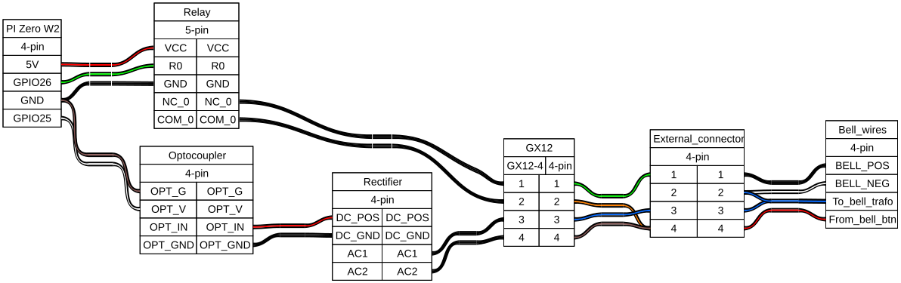
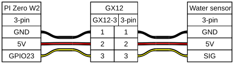

# Gcontroller

[HMD-DGB](https://github.com/jvanoosterhout/HMD-DGB) usage example with hardware and configuration to make dumb systems in my Garage (Dutch: Garage → G) smart and connect them to Home Assistant.


**Status:** Working personal build, though still in progress; hardware documentation and software setup are provided for adaptation and replication.

## Project Map

- **Hardware and build:** [Hardware Design](#hardware-design), [Pinout & Wiring](#pinout--wiring), and [Assembly Instructions](#assembly-instructions)
- **Wiring sources and diagrams:** [hardware/wiring/](hardware/wiring/), with generated output in [hardware/wiring/generated/](hardware/wiring/generated/)
- **Assembly photos:** [images/](images/)
- **Bill of materials:** [hardware/bom.csv](hardware/bom.csv)
- **Installation and Home Assistant configuration:** [software/](software/) and [docs/](docs/)
- **Release history:** [CHANGELOG.md](CHANGELOG.md)

## Overview

The **Gcontroller** is a Raspberry Pi Zero 2 W-based controller designed to manage dumb devices and sensors in a Garage as smart IoT devices. This is my second Pi controller. Its development started in ...  as both a need to prevent expensive replacement of garage door remotes my wife lost and controlling the irrigation of my garden.

### History & Motivation

<!-- The desire to create this controller existed for a long time, but development began in Q1 2026 following the major update to my [HMD-DGB](https://github.com/jvanoosterhout/HMD-DGB) project. The primary objectives were straightforward but practical:

- **Monitor water consumption** to know when to refill the water softener with salt
- **Detect doorbell activation:** We frequently miss the bell while in the garden, and I do not want to invest in a commercial smart doorbell.
- **Control the doorbell:** Disable the physical ring while maintaining sensor capability for notifications.

A secondary objective arose when the [HMD-DGB](https://github.com/jvanoosterhout/HMD-DGB) project matured at the beginning of Q1 2026: serving as a **test system** for HMD-DGB releases. Other controllers (MV: mechanical ventilation, BK: bathroom lights, and G: garage door and garden irrigation, running the former [GPIOpinAPI](https://gitlab.com/jotd/gpiopinapi) or even older software) manage essential household functions and could not risk crashes from experimental code.

In Q1, the Pi already served as a stand-alone test platform for pre-alpha releases. Its purpose was to test whether the principles of [HMD-DGB](https://github.com/jvanoosterhout/HMD-DGB) would work for multiple days in a row. It therefore ran successfully for more than 10 straight days with the [MQTT_duration_run](https://github.com/jvanoosterhout/HMD-DGB/blob/main/Examples/venv_MQTT_project/MQTT_duration_run.py) example.

By mid-Q2 2026, the MKcontroller had reached a form ready for testing alpha releases of HMD-DGB v1.0.0.

By the end of Q2, [HMD-DGB](https://github.com/jvanoosterhout/HMD-DGB) had reached the beta-release stage. During this testing period, I started documenting the project for my own traceability and to share the design so others can replicate or adapt the concepts.

Note that not all wire colors are ideal. I try to reuse as many components as possible. As a result, the [doorbell wiring](#doorbell-wiring) uses an old UTP cable whose clips broke off. The [rectifier](#soldering) was added later using parts I had on hand, so I needed to cut the original wires. The optocoupler is cut into two pieces because I needed only one channel in this controller. -->

---

## Requirements

### Core Functionality
<!-- - [x] Measure doorbell button presses (for Home Assistant automation → notifications)
- [x] Enable/disable doorbell ring while maintaining sensor capability (with HA automation to auto-toggle after X hours)
- [x] Failsafe: Default state on Pi/controller failure is doorbell rings normally
- [x] Measure hard water consumption -->

### Optional Features
<!-- - [ ] Measure softened water consumption
- [ ] Measure utility cupboard temperature
- [ ] Control ventilation fans (utility cupboard gets warm from city heating system + network equipment + NAS; keeping it cool prevents water softener degradation)
- [ ] Measure city heating consumption -->

### Connectivity
- Ethernet connection with poe
- GX12-6 connectors for the garage door. 
- tulip connectors for power and control of the irrigation actuators.

---

## Hardware Design

### Bill of Materials

The BOM is stored in [hardware/bom.csv](hardware/bom.csv). The table below is generated from that file.

<!-- BOM:START -->

| Category | Component | Details | Qty | Status | Notes |
|----------|-----------|---------|-----|--------|-------|
| controller | Raspberry Pi Zero 2 W | Main controller | 1 | required | Single-board computer |
| network | [Waveshare USB Ethernet HUB HAT for Raspberry Pi Zero](https://www.kiwi-electronics.com/nl/poe-ethernet-usb-hub-hat-voor-rpi-zero-10711) | Gigabit Ethernet and USB connectivity | 1 | required | Required for wired network connection |
| thermal | [Waveshare aluminium heatsink](https://elektronicavoorjou.nl/product/heatsink-raspberry-pi-zero/) | Thermal management | 1 | required | For Raspberry Pi Zero 2 W |
| isolation | [2-channel optocoupler module](https://www.tinytronics.nl/en/switches/optocouplers/optocoupler-isolation-module-2-channels) | Signal isolation | 1 | required | Doorbell sensor |
| power | 100uF 35V capacitor | Power conditioning | 1 | required | Added during assembly |
| protection | [1N4148 diode](https://www.conrad.nl/nl/p/diotec-ultrasnelle-si-diode-1n4148-sod-27-75-v-150-ma-162280.html) | Doorbell signal protection | 1 | required | 100V 100mA signal diode |
| connector | [GX12-3 connector](https://www.tinytronics.nl/en/cables-and-connectors/connectors/aviation-style/gx12/gx12-3-connector-set) | Water sensor connection | 2 | required |  |
| connector | [GX12-4 connector](https://www.tinytronics.nl/en/cables-and-connectors/connectors/aviation-style/gx12/gx12-4-connector-set) | Doorbell sensor and control connection | 1 | required |  |
| connector | [GX12-2 connector](https://www.tinytronics.nl/en/cables-and-connectors/connectors/aviation-style/gx12/gx12-2-connector-set) | Optional ventilation fan connection | 1 | optional |  |
| network | [Panel-mount Ethernet extension cable](https://www.kiwi-electronics.com/nl/panel-mount-ethernet-verlengkabel-2542) | Ethernet connection | 1 | required |  |
| power | [Delock Micro USB connector](https://www.reichelt.com/nl/nl/shop/product/usb_2_0-kabel_micro_b-bus_naar_micro_b-stekker_0_25_m-212024) | Power input | 1 | required |  |
| connector | [Removable screw terminal 2-pin 3.81mm](https://www.tinytronics.nl/en/cables-and-connectors/connectors/screw-terminals/removable-screw-terminal-2p-3.81mm) | Terminal connection | 1 | required |  |
| sensor | [YF-B6 water flow sensor](https://www.tinytronics.nl/en/sensors/liquid/yf-b6-water-flow-sensor-brass-g3-4) | Water measurement | 1 | required | G3/4 inch |
| enclosure | [BOX4U industrial enclosure](https://www.reichelt.com/nl/nl/shop/product/industriele_behuizing_125_x_115_x_58_mm_ip65_lichtgrijs-324314) | Enclosure | 1 | required | 125 x 115 x 58 mm IP65 |
| enclosure | Kradex enclosure | Alternative enclosure | 1 | alternative | 176 x 126 x 57 mm IP65; used for an earlier version |
| control | [5V 2-channel relay module](https://www.tinytronics.nl/en/switches/relays/relay-modules/5v-relay-2-channel-high-active-or-low-active) | Doorbell control | 1 | required | High-active or low-active variant |
| assembly | Wago clamps | Terminal connections | as required | required |  |
| connector | [3-way JST-SM extension cable](https://www.kiwi-electronics.com/nl/3-weg-jst-sm-verlengkabel-1-meter-1123) | Water sensor cable | 1 | required |  |
| assembly | Laser-cut mounting plate | Internal mounting | 1 | required |  |
| assembly | PCB prototyping board | Small wiring board | 1 | required | Approximately 6 x 12 holes |
| assembly | Jumper cables heat shrink and masking tape | Wiring and assembly | as required | required |  |

<!-- BOM:END -->

Regenerate this table after changing the CSV with:

```sh
python3 software/generate-bom-table.py
```


### Tools Required
- 13mm drill
- 3mm drill
- File (to make drill holes square)
- Soldering iron
- Wire stripper (striptang)
- Screwdrivers
- Digital multimeter (for safety verification)

---

## Pinout & Wiring

### GPIO Assignments


<!-- | Function | GPIO (BCM) | Notes |
|----------|------|-------|
| Doorbell Sensor | GPIO 25 | PinIn |
| Doorbell Relay 0 | GPIO 26 | PinOut |
| Hard Water Sensor | GPIO 23 | PinCount |
| Soft Water Sensor | GPIO 24 | PinCount (optional) |
| Temperature Sensor | **[TBD]** | Optional onewire/I2C |
| Fan Control | **[TBD]** | Optional PWM or relay | -->

### Garage door wiring

<!-- The doorbell operates on an 8 V AC transformer that can deliver ... A/W. This makes the correct cable diameter important to prevent the wires from becoming too warm. I did not perform the exact calculation, but knowing that a UTP cable (I had one with broken connectors) can transfer 90 W at 57 V, meaning less than 2 A, and that only four wires are needed, I decided to solder the corresponding colored wires together. This should safely allow more than 3 A.



Note that the external connector is slightly unusual. It simplified assembly of the controller because I only had to work with four wires, two per sensor. The photo below shows the actual implementation of this connector. The BU/RD wires were originally connected directly to the doorbell and came from the transformer and button. I removed these wires from the bell and connected the WH/WH-BK wire to it instead. Reconnecting the BU/RD and WH/WH-BK wires would restore the original state.

 -->

### Irrigation power and control  wiring

<!-- Water 1 (Hard) & Water 2 (Soft - optional at GPIO24):
 -->

---

## Assembly Instructions

### Preparation
1. **Prepare casing**
   - Cut internal edges away, these will otherwise trouble installing the connectors.
   - Mark hole positions on the sides for connectors. Mind the height of the custom bottom plate; connectors must fit clearly above the mounting plate.
   
2. **Fabricate holes**
   - Drill 13mm holes for GX12 connectors
   - Drill 3mm holes at the edges of the box marked for the USB and Ethernet connectors
   - File edges and burrs smooth

3. **Prepare wiring**
   - Pre-cut and strip all internal & external jumpers and wires.
   - Pre-tin connector pins and wires

### Soldering
4. **Heat-shrink preparation**
   - Slide (but do not shrink yet) heat shrink tubes over all wires that need isolation.

5. **Solder components** (in this order)
   - Pi GPIO headers to the Pi Zero 2 W
   - Wires to the GX12 connectors (do not forget to slide the covers onto the wire bundle first)
   - Diodes (bridge rectifier) + capacitor + wires to the PCB prototyping board


### Assembly
6. **Mount to internal board**
   - Mount Pi + relay board + optocoupler on custom mounting plate
   - Connect all signal and power wires

7. **Testing (before final sealing)**
   - Verify the end-to-end wiring with a digital multimeter (continuity test)
   - Verify the isolation between wires with a digital multimeter (continuity test)
   - **Better to catch mistakes now than after shrinking & sealing**

### Final Assembly
8. **Mount in enclosure**
   - Place custom mounting plate in casing
   - Mount all external connectors in casing
   - Route wires

9. **Connect wiring**
   - Connect all external connectors to board
   - Re-test with a digital multimeter before shrinking


10. **Finalize**
    - Heat shrink all joints
    - Label/document all connectors (optional but recommended)
    - Final functional test with HMD-DGB


---

## Software Setup
Prerequisites:
- Home Assistant running
- MQTT broker running
- Raspberry Pi OS Bookworm 32-bit (lite)
- Python 3.10, 3.11 or 3.12

### Installation
The installer targets Bookworm OS and must be run on the Pi with Python 3.10, 3.11, or 3.12. It installs HMD-DGB v1.0.0b4 in a local virtual environment and creates a systemd service. I prefer to perform this setup over SSH.

```sh
git clone https://github.com/jvanoosterhout/Gcontroller.git
cd Gcontroller
sudo ./software/install.sh \
   --service-name g_controller \
   --install-dir "$PWD" \
   --broker 192.0.2.10 \
   --port 1883 \
   --username mqtt_user \
   --password 'change-me' \
   --location meterkast \
   --rate 300
```

Replace the example broker, username, and password with your own values. The installer accepts configuration through command-line options only and stores the settings in `/etc/mk_controller.env` with root-only permissions for systemd to load. Check the service with `sudo systemctl status mk_controller` and view logs with `sudo journalctl -u mk_controller`.

### Configuration
After installation, import or adapt the retained MQTT configuration in [software/HA_automation.yaml](software/HA_automation.yaml). You can create a new automation, edit it in YAML mode, and then copy and paste the content from [software/HA_automation.yaml](software/HA_automation.yaml). It defines the doorbell and hard-water entities used by the examples in [docs/home-assistant.md](docs/home-assistant.md).

### Home Assistant Integration
<!-- Doorbell notification and auto-toggle examples (currently AI-generated and not tested): [docs/home-assistant.md](docs/home-assistant.md) -->

### Update HMD-DGB
In case you like to update the HMD-DGB software 
- Login to the pi 
- Activate the venv
- Install the new version by replacing v1.0.0b4 with the desired one, or by removing @v1.0.0b4 entirely to get the latest commit. 

   `pip install git+https://github.com/jvanoosterhout/HMD-DGB.git@v1.0.0b`
- In Home Assistant, go to the service device and click `soft restart`.

### Home Assistant interface 

In Home Assistant, you will see the node and service devices:
| Node      | service       |
| -------------- | -------------- |
| |  |

The doorbell and water meter devices are also present:
| Node      | service       |
| -------------- | -------------- |
| |  |


<!-- ---

## Failsafe Behavior

On power loss or Pi crash, the doorbell operates in its **normal state** (rings) due to the relay design:
- Relay is wired as **Normally Closed (NC)** on the doorbell trigger
- When relay is de-energized → doorbell rings normally
- When relay is energized (via GPIO 26) → doorbell is silenced

This ensures that even if the Pi is completely offline, the doorbell remains functional. -->

---

## Related Projects

- **[HMD-DGB](https://github.com/jvanoosterhout/HMD-DGB)** - Home automation control platform
- **Other Controllers:**
  - MV (Mechanical Ventilation)
  - BK (Bathroom Lights, in Dutch: BadKamer → BK)
  - [MK (utility cupboard, in Dutch: MeterKast → MK)](https://github.com/jvanoosterhout/MKcontroller)

---

## License & Disclaimer

This is a personal home automation project shared as-is for educational purposes. Use at your own risk. Electrical work involving relays and/or high voltage should be performed safely and verified before deployment.

---

## TODO

- [ ] Add configuration file examples
- [ ] Add Home Assistant automation examples
- [ ] Add wiring diagram/schematic
- [ ] Add photos of assembled controller
- [ ] Document temperature sensor integration (optional)
- [ ] Document fan control logic (optional)
