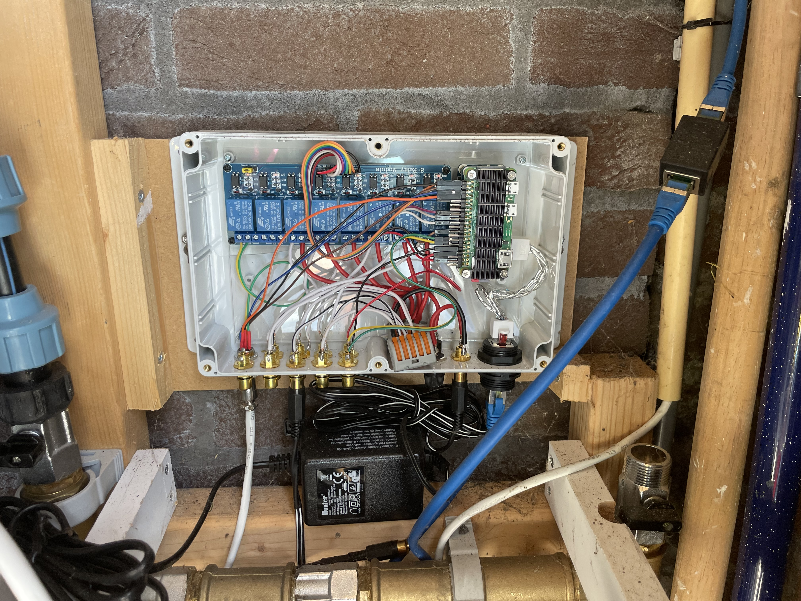
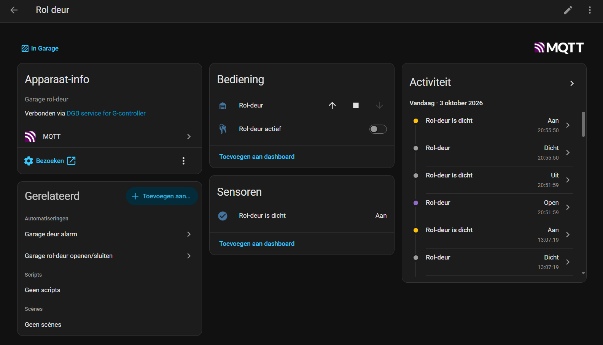
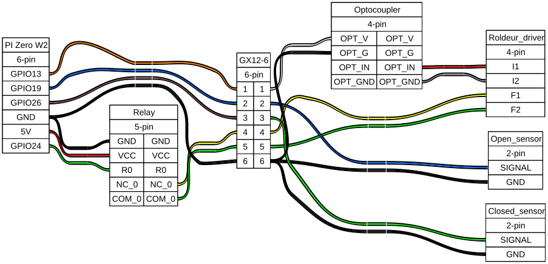
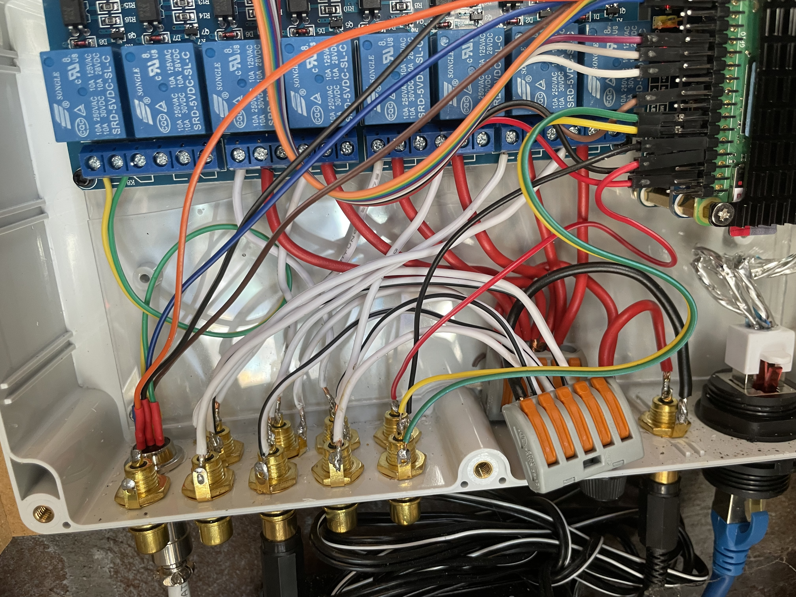
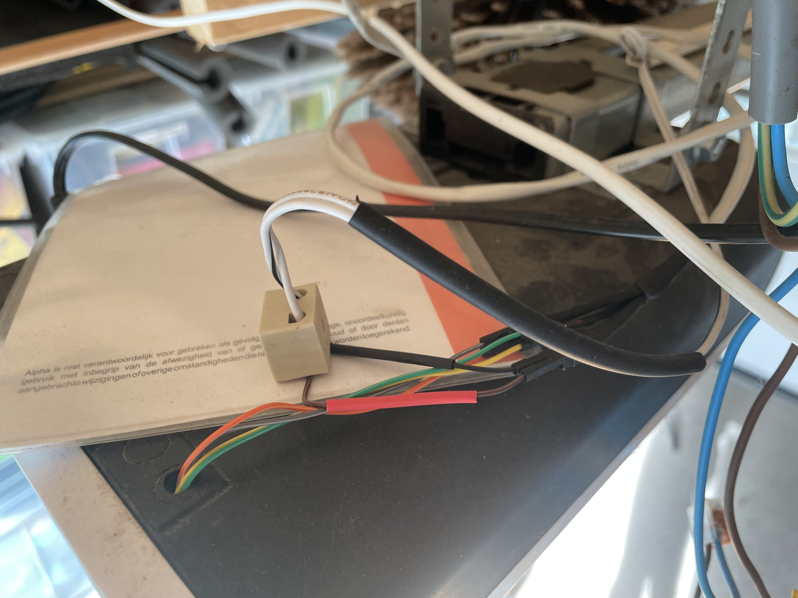
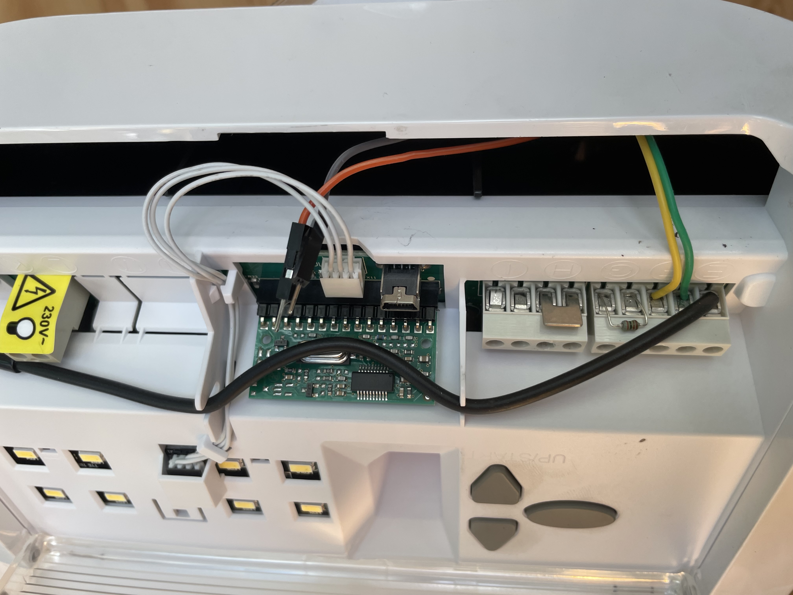
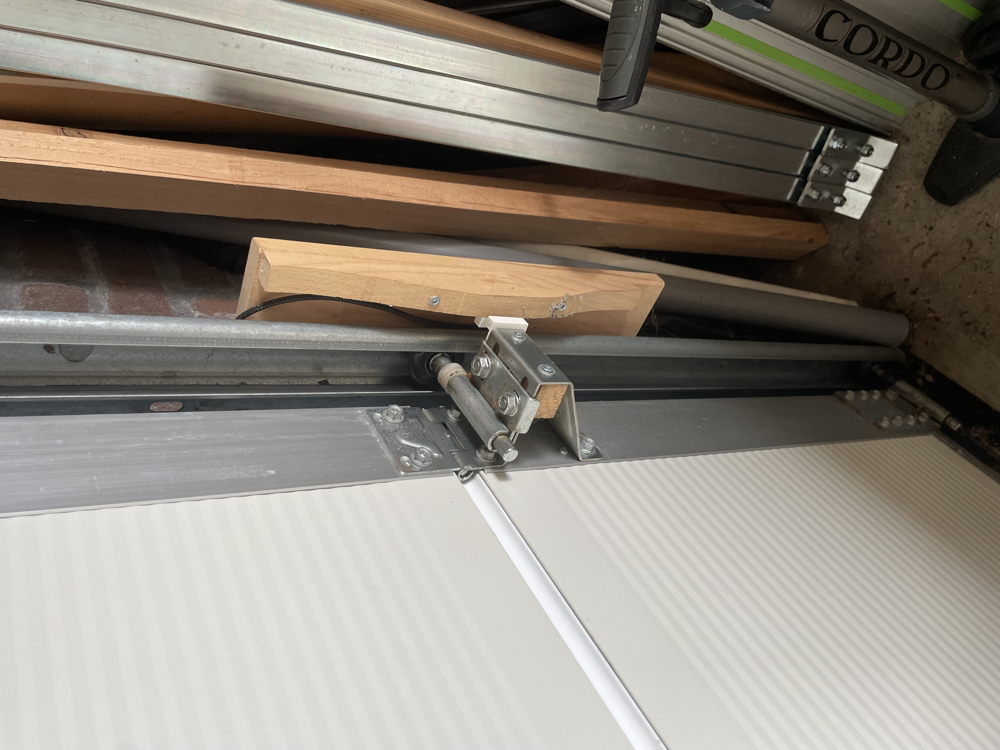
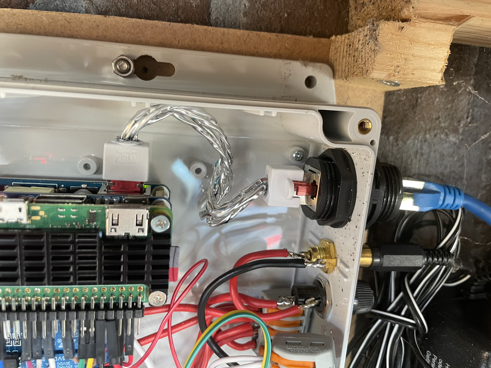

# Gcontroller

**Work in progress:** This README and the project documentation are still being updated.

Gcontroller is a Raspberry Pi Zero 2 W-based controller for connecting garage-door and garden-irrigation equipment to Home Assistant. It uses [HMD-DGB](https://github.com/jvanoosterhout/HMD-DGB) to communicate over MQTT.



<!--  -->

**Status:** Working personal build. Hardware documentation and software setup are provided so the project can be adapted or replicated.

## Project Map

- **Hardware and build:** [Hardware Design](#hardware-design), [Pinout & Wiring](#pinout--wiring), and [Assembly Instructions](#assembly-instructions)
- **Wiring sources and diagrams:** [hardware/wiring/](hardware/wiring/), with generated output in [hardware/wiring/generated/](hardware/wiring/generated/)
- **Assembly photos:** [images/](images/)
- **Bill of materials:** [hardware/bom.csv](hardware/bom.csv)
- **Installation and Home Assistant configuration:** [software/](software/) and [docs/](docs/)
- **Release history:** [CHANGELOG.md](CHANGELOG.md)

## Overview

The **Gcontroller** connects devices and sensors in my garage and garden to Home Assistant. It can control the garage door and irrigation valves, and report the garage door's state. This is my second Raspberry Pi controller.

### History & Motivation

The project grew out of two practical needs: avoiding the cost of replacing an expensive garage-door remote and making it easier to control the garden irrigation system. The design work began in Q2-Q3 2023, after my wife lost a second €60 garage-door remote. The controller was probably operational by Q2 2024, although I did not document much of the development at the time.

The main goals were to:

- Control the garage door without relying on another expensive replacement remote.
- Get a reminder if the garage door remains open, for example when it is obstructed or does not close fully. The reminder repeats every 10 minutes while the door remains open.
- Replace two Philips Hue smart plugs used for irrigation and make it easier to add more valves.

When we moved into our newly built home in 2020, I installed an irrigation system beneath the lawn, with drip lines along the garden borders and two valves. I initially controlled the valves with Philips Hue smart plugs. Each plug needed an adapter, and I wanted the option to add more valves.

The wider home-automation project was guided by a preference for affordable, understandable, and maintainable systems, with Home Assistant as the central control platform. Gcontroller applies those goals to the garage and garden. It was built around a Raspberry Pi Zero 2 W; PoE was a practical choice for the garage, where wired networking and the required parts were already available.

The first version used a generic REST API and a custom GPIO backend. As more controllers and use cases were added, maintaining separate backends became difficult, so GPIO control was extracted into the reusable GPIOapi package in Q2 2024. In Q1-Q2 2026, the project began replacing that REST-based interface with HMD-DGB's MQTT device model. This moves pin-level details and device configuration out of Home Assistant and groups related entities as devices. Gcontroller is running HMD-DGB sinds Q3-2026 at which time this example documentation was also setup.

---

## Requirements

### Core Functionality
- Control the garage door through a relay and monitor its state.
- Connect the controller to Home Assistant through MQTT.
- Control up to six garden-irrigation valves.

### Connectivity
- Ethernet over PoE.
- GX12-6 connector for the garage-door wiring.
- RCA connectors for the irrigation-valve controls.
- Low-voltage power connector for the valve adapter.

---

## Hardware Design

### Bill of Materials

The BOM is stored in [hardware/bom.csv](hardware/bom.csv). The table below is generated from that file.

<!-- BOM:START -->

| Category | Component | Details | Qty | Status | Notes |
|----------|-----------|---------|-----|--------|-------|
| enclosure | Kradex enclosure | Alternative enclosure | 1 | alternative | 176 x 126 x 57 mm IP65; used for an earlier version |
| controller | Raspberry Pi Zero 2 W | Main controller | 1 | required | Single-board computer |
| network | [PoE Ethernet / USB HUB HAT for Raspberry Pi Zero](https://www.berrybase.de/en/poe-ethernet-usb-hub-hat-for-raspberry-pi-zero-1x-rj45-3x-usbisolation) |  | 1 |  |  |
| control | [5V 8-channel relay module](https://www.berrybase.de/en/5v-8-channel-relay-module) |  | 1 |  |  |
| connector | [GX12-6 connector](https://www.tinytronics.nl/en/cables-and-connectors/connectors/aviation-style/gx12/gx12-6-connector-set) | Connector for wiring towards garage door sensors and control | 1 | required |  |
| connector | [RCA connector](https://www.reichelt.com/nl/nl/shop/product/tulp_chassisdeel_inbouw_geisoleerd_verguld_met_gekl_-143) |  | 2-5 |  |  |
| connector | [RCA connector with bend protection](https://www.reichelt.com/nl/en/shop/product/rca_connector_with_bend_protection_black_gold-plated-6900?search=CSPG%2520SW&) |  | 2-5 |  |  |
| sensor | [Reed switch](https://www.tinytronics.nl/nl/schakelaars/magneetschakelaars/deur-schakelaar-reed-relais-met-magneet) |  | 2 |  |  |
| assembly | Wago clamps | Terminal connections | as required | required |  |
| assembly | Jumper cables heat shrink and masking tape | Wiring and assembly | as required | required |  |
| power | [Hunter losse transformator 24Vac](https://www.doehetzelfberegening.shop/hunter-losse-transformator-24vac.html) |  | 1 |  |  |
| control | [Hunter PGV 1" magneetklep met flowcontrol](https://irritech.nl/hunter-pgv-1-magneetklep-met-flowcontrol-be.502.104/) |  | 2-5 |  |  |

<!-- BOM:END -->

Regenerate this table after changing the CSV with:

```sh
python3 software/generate-bom-table.py
```


### Required Tools
- 13mm drill
- 3mm drill
- File (to make drill holes square)
- Soldering iron
- Wire stripper
- Screwdrivers
- Digital multimeter (for safety verification)

---

## Pinout & Wiring

### GPIO Assignments

| Function | GPIO (BCM) | Notes |
|----------|------|-------|
| Garage door pulse (`garage_deur_puls`) | GPIO 24 | PinOut to relay R0 (R0 routs via GX12 pin 4 & 5)|
| Door active sensor | GPIO 13 | PinIn to optocoupler via GX12 pin 1 |
| Door open sensor | GPIO 19 | PinIn via GX12 pin 2 |
| Door closed sensor | GPIO 26 | PinIn via GX12 pin 3 |
| Loose IO (red/black) | GPIO 4 |  |
| Loose IO (green/yellow) | GPIO 18 |  |
| Valve 1 | GPIO 21 |  |
| Valve 2 | GPIO 20 |  |
| Valve 3 | GPIO 16 |  |
| Valve 4 | GPIO 12 |  |
| Valve 5 | GPIO 7 |  |
| Valve 6 | GPIO 8 |  |
| Spare | GPIO 25 |  |

### Garage-Door Wiring








---

## Assembly Instructions

### Preparation
1. **Prepare casing**
   - Cut internal edges away, these will otherwise trouble installing the connectors.
   - Mark hole positions on the sides for connectors. Mind the height of the custom bottom plate; connectors must fit clearly above the mounting plate.
   
2. **Fabricate holes**
   - Drill 13mm holes for GX12 connectors
   - Drill 3mm holes at the edges of the box marked for the USB and Ethernet connectors
   - File edges and burrs smooth

   


3. **Prepare wiring**
   - Pre-cut and strip all internal & external jumpers and wires.
   - Pre-tin connector pins and wires

### Soldering
4. **Heat-shrink preparation**
   - Slide (but do not shrink yet) heat shrink tubes over all wires that need isolation.

5. **Solder components** (in this order)
   - Pi GPIO headers to the Pi Zero 2 W
   - Wires to the GX12 connectors (do not forget to slide the covers onto the wire bundle first)


### Assembly
6. **Mount to internal board**
   - Mount Pi + relay board + optocoupler on custom mounting plate
   - Connect all signal and power wires

7. **Testing (before final sealing)**
   - Verify the end-to-end wiring with a digital multimeter (continuity test)
   - Verify the isolation between wires with a digital multimeter (continuity test)
   - **Better to catch mistakes now than after shrinking & sealing**

### Final Assembly
8. **Mount in enclosure**
   - Place custom mounting plate in casing
   - Mount all external connectors in casing
   - Route wires

9. **Connect wiring**
   - Connect all external connectors to board
   - Re-test with a digital multimeter before shrinking
10. **Finalize**
    - Heat shrink all joints
    - Label/document all connectors (optional but recommended)
    - Final functional test with HMD-DGB


---

## Software Setup
### Prerequisites
- Home Assistant running
- MQTT broker running
- Raspberry Pi OS Trixie 32-bit (lite)
- Python 3.13

### Installation
Run the installer on the Raspberry Pi. It creates a local virtual environment, installs the current HMD-DGB version from GitHub, and creates and enables a systemd service. I recommend performing the setup over SSH.

```sh
git clone https://github.com/jvanoosterhout/Gcontroller.git
cd Gcontroller
sudo ./software/install.sh \
   --service-name Gcontroller \
   --install-dir "$PWD" \
   --broker 192.0.2.10 \
   --port 1883 \
   --username mqtt_user \
   --password 'change-me' \
   --location Garage \
   --rate 300
```

Replace the example broker, username, and password with your own values. The installer accepts configuration through command-line options and stores it in `/etc/Gcontroller.env` with root-only permissions. Check the service with `sudo systemctl status Gcontroller` and view its logs with `sudo journalctl -u Gcontroller`.

### Configuration
After installation, create a Home Assistant automation in YAML mode and paste or adapt the configuration in [software/home-assistant-DGB-config-automation.yaml](software/home-assistant-DGB-config-automation.yaml). It publishes the retained MQTT configuration for the garage-door cover, lock switch, and closed-state sensor. The automation examples in [software/home-assistant-automation-helpers.md](software/home-assistant-automation-helpers.md) show how to operate the door and send an alert if it remains open.

### Home Assistant Integration
The MQTT configuration exposes the garage door as a cover and provides a switch to temporarily enable operation. Adapt the example automations to your Home Assistant entities and notification service.

### Updating HMD-DGB
From the installation directory on the Pi, activate the virtual environment and upgrade HMD-DGB:

```sh
source venv/bin/activate
pip install --upgrade git+https://github.com/jvanoosterhout/HMD-DGB.git
sudo systemctl restart Gcontroller
```

### Home Assistant Interface

Home Assistant discovers the HMD-DGB node and service devices. The garage-door configuration adds a cover, a lock switch, and a binary sensor that reports whether the door is closed.

---

## Related Projects

- **[HMD-DGB](https://github.com/jvanoosterhout/HMD-DGB)** - Home automation control platform
- **Other Controllers:**
  - [MV (Mechanical Ventilation)](https://github.com/jvanoosterhout/MVcontroller)
  - BK (Bathroom Lights, in Dutch: BadKamer → BK)
  - [MK (utility cupboard, in Dutch: MeterKast → MK)](https://github.com/jvanoosterhout/MKcontroller)

---
## License & Disclaimer

This is a personal home automation project shared as-is for educational purposes. Use at your own risk. Electrical work involving relays and/or high voltage should be performed safely and verified before deployment.
